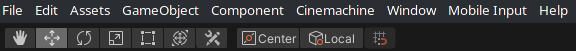

We all know these people, they sit in front of a computer and it seems like they just use some kind of darf magic. New windows open, tools changes within seconds, they search for things without even touching the mouse. And after a blink they changed so much and you have no idea what happend. 

This magic is called the usage of shortcuts. And like everything in the IT in general, you first need to know they exists and after that it's easy to use them or search for them in case you forgot it. 

Unity have a lot of useful shortcuts and today I want to show you some of them. I discovered recently, a lot of people don't know a lot of "common" shortcuts, so this post will cover these too. 

At the end I hope you can practice the magic of shortcuts yourself. Before getting started... Almost every shortcut I tell you about are also written down in Unity itself and you can edit them if you want to have it different. 
Just go to `Edit -> Shortcuts...` in your Unity Window. But now, lets get started!

## Object Tools
Maybe one of the first things you came across while using Unity are these object tools.

There are different ways to manipulate an object in a scene. First of all you can set the position, rotation and scale in the Transform Component. But sometimes you don't know the values you want. Maybe you want to try things out to get a feeling for the values. 

In this case you can switch between these tools. With each of them you can manipulate the object by dragging an arrow or something else around. This is really quick and it can be useful to quickly switch between the Move and Rotation Tool for example. Especially if you're not a real fan of the combination tool, where you can do everything at the same time.

These tools have a really easy shortcut. You just need to remember one key and then you can find out any tool. Great right? 
The Shortcuts are as followed:

| Tool          | Shortcut-Key  |
| ----          | ----          | 
| Hand Tool     | Q             |
| Move Tool     | W             |
| Rotate Tool   | E             |
| Scale Tool    | R             |    
| Rect Tool     | T             |     
| Combined Tool | Y             |

The trick is, that the order of the keys are the same as displayed at the top of your unity editor. 
You can easily switch between those tool without moving your mouse away from your object just by looking at the top of you editor (or just try it out until you have the right one). 

If you are using a qwertz keyboard, you may notice that your combined tool is not in the row as all the others. But I think that is okay, because either you get used to it or you just use the single tools as I do. 

Two additional shortcuts worth to know are for toggle the values next to the tools. To look at the center of an object or its pivot (especially useful when editing a UI) and toggle between global and local transform of an object. 

| Tool                  | Shortcut-Key  | 
| ---                   |     ---       |
| Toggle Pivot/Center   |  Z            | 
| Toggle Global/Local   |  X            |

Again QWERZ-Keyboard kinda messed with Unitys intention to have it between each other, but you 

## Expanding/collapse GameObjects

## Renaming GameObjects

## Placing Objects

---
---
## Additional Information
I currently use:
-  Unity 2019.4.1.17f1